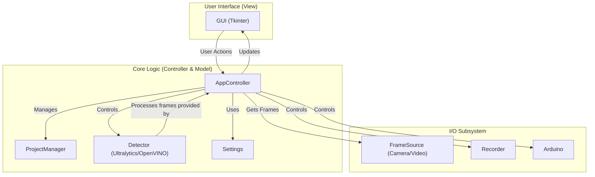

# PyZebArdYolo

PyZebArdYolo is a real-time acquisition unit for behavioral neuroscience: a
graphical application that couples a consumer webcam to YOLO11-based object
detection (via Ultralytics / OpenVINO) and an Arduino Uno R3, delivering
position-contingent visual stimulation (RGB LEDs) to adult zebrafish
(*Danio rerio*) in closed loop, fully offline (no internet, no dedicated
GPU). It runs live camera feeds or pre-recorded videos and is intended for
scientific research.

> **Not the same software as "DRerio LogAI".** DRerio LogAI is a separate,
> more advanced multi-aquarium tracking and statistical-reporting platform
> by the same authors, registered as a computer program with INPI (Brazil)
> under process **BR 51 2026 005215-7**, titular **Universidade Estadual
> Paulista "Júlio de Mesquita Filho" (UNESP)**. PyZebArdYolo is not covered
> by that registration and is released independently. See `NOTICE` §0.

## Installation

This project is managed with [Poetry](https://python-poetry.org/).

1.  **Clone the repository:**
    ```bash
    git clone https://github.com/MarkSant/PyZebArdYolo.git
    cd PyZebArdYolo
    ```

2.  **Install Poetry:**
    Follow the official instructions at [python-poetry.org](https://python-poetry.org/docs/#installation) to install Poetry on your system.

3.  **Install dependencies:**
    Once Poetry is installed, run the following command in the project root to create a virtual environment and install the required dependencies:
    ```bash
    poetry install
    ```

## Usage

To run the application, use the following command from the project's root directory:

```bash
poetry run python -m zebtrack
```

This will launch the main graphical user interface.

## Architecture

The application is designed with a separation of concerns, loosely following a Model-View-Controller (MVC) pattern.



*   **GUI**: The user interface, built with Tkinter.
*   **AppController**: The central component that handles user input from the GUI and coordinates all other components.
*   **ProjectManager**: Manages the creation, loading, and saving of project files and configurations.
*   **Detector**: Performs object detection on video frames using models from `ultralytics` or `OpenVINO`.
*   **FrameSource**: Provides video frames, either from a live camera feed or a video file.
*   **Recorder**: Handles the saving of output video and tracking data.
*   **Arduino**: Manages communication with an Arduino board for hardware I/O.
*   **Settings**: Loads and manages application settings from configuration files.

## Authors

*   Marco Antônio Sant'Ana Camargos — São Paulo State University (UNESP), Botucatu, Brazil — marco.sant@unesp.br
*   Percília Cardoso Giaquinto — São Paulo State University (UNESP), Botucatu, Brazil — percilia.giaquinto@unesp.br

## Citation

If you use this software in your research, please cite it — see [`CITATION.cff`](CITATION.cff).

## License

The authors' own code (and the Arduino firmware) is MIT-licensed. However,
the **combined, distributed application** bundles Ultralytics YOLO
(AGPL-3.0), which makes the effective license of the distributed work
**AGPL-3.0**. Trained weights and the training dataset carry their own
attribution requirements (CC BY 4.0), and hardware design files are
CERN-OHL-S v2.

See [`LICENSE`](LICENSE) for the MIT text and [`NOTICE`](NOTICE) for the
full breakdown (third-party licenses, dataset attribution, and what
"effective AGPL-3.0" means for redistribution).
